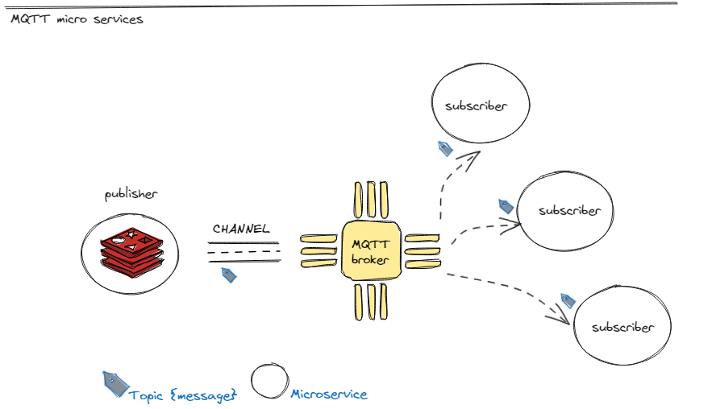
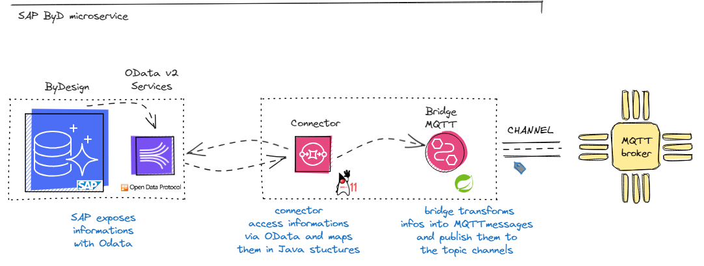

# ByDesign Microservice

In this project, the microservice is built by integrating a connector and a bridge. 
Developed in Java v.11, the connector allows access to services and information 
in an SAP ERP (SAP ByDesign product). 
The connector utilizes the OData protocol to query and manipulate ERP data. 
Additionally, a bridge uses the Spring framework to interact with an MQTT 
(Message Queuing Telemetry Transport) broker and expose the services, 
mediated by the connector, to other systems.

## Examples of Possible Usage
Through OData, it is possible to query SAP products, sales orders, invoices, warehouse stock, etc., which a company has recorded in the ERP. This information can be made available to services registered on MQTT, such as billing services, quality controls, e-commerce, etc.

## MQTT
MQTT (Message Queuing Telemetry Transport) is a lightweight messaging protocol based on 
a publish/subscribe model, allowing devices to publish messages on specific
topics and recipients to subscribe to receive them.

## OData

OData (Open Data Protocol) is an open protocol that allows the creation and consumption of RESTful APIs that are queryable and interoperable in a simple and standardized way. The retrieval and modification of data are performed using URL-based service calls.
## SAP and OData

SAP allows the creation of OData services based on its Business Objects, generating a metadata representation in XML format.
## Generation of Java Client and Connector

In this instance,  metadata is used to generate Java client objects that represent SAP Business Objects and their services. 
This process automates the client's creation, making the system easily adaptable to any changes in the ERP's data model. 
The connector created in the project uses the client's objects  
to access the ERP and perform queries or modifications on the system via authenticated RESTful calls.

## Integration in MQTT

The bridge developed in this project uses the Spring framework to register with an MQTT broker and engage in asynchronous interactions.
Information extracted from the ERP is dispatched to the broker via messages.
Conversely, the broker can instruct the bridge to access services exposed by SAP. 
A key function of the bridge is to convert client objects into standardized structures for
the broker, thereby streamlining communication among the various services registered on the broker.

#### Microservice overview

